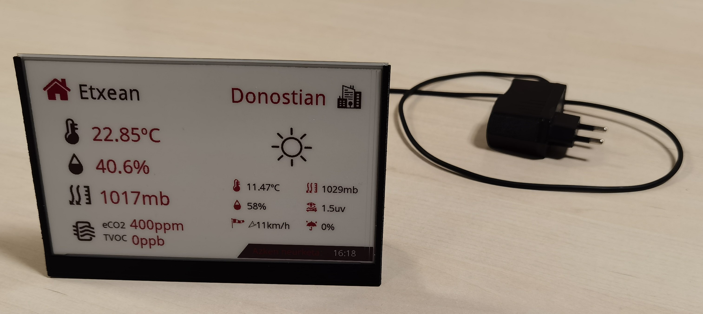
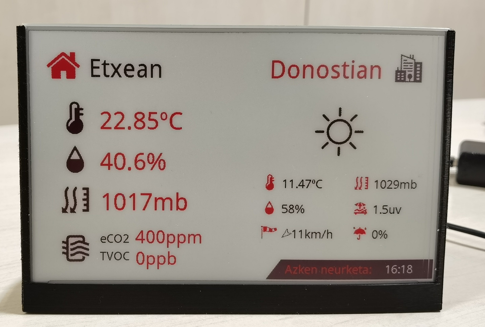
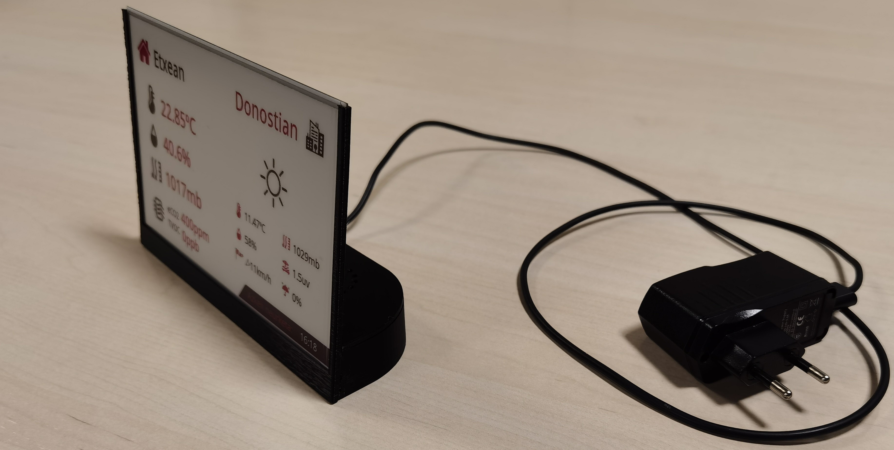
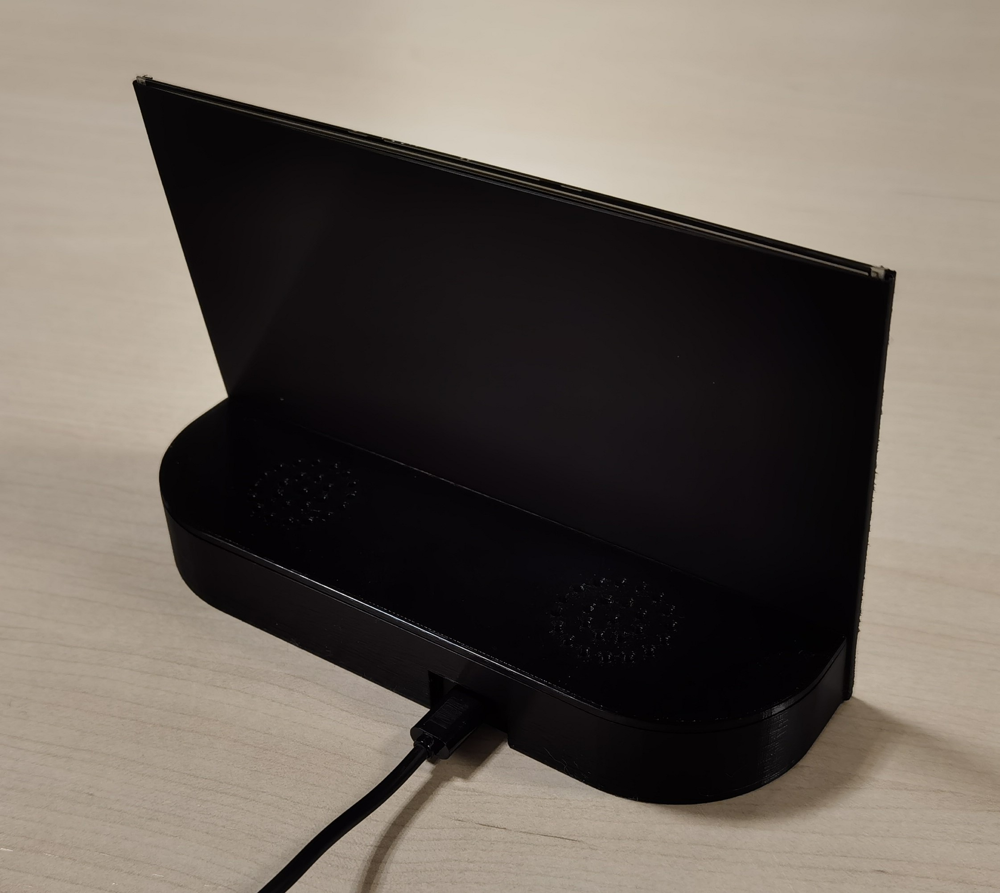

# eNotifier

The eNotifier is a simple Notification panel based on a WaveShare <a href="https://www.waveshare.com/7.5inch-e-paper-hat-b.htm">7.5'' ePaper display</a>. In the current stage, the notifier has weather station features, but can be extended to further functionalities with ease.

In order to control the device a Raspberry Pi Zero W has been included. For home air measurements, the Air Quality sensor BME680 from Bosch and Gas sensor SGP30 from Sensirion have been used. In both cases, Pimoroni breakout boards have been used <a href="https://shop.pimoroni.com/products/sgp30-air-quality-sensor-breakout">SGP30</a> and <a href="https://shop.pimoroni.com/products/bme680-breakout">BME680</a>.

The design includes 3D files for enclosure and Raspberri Pi Zero W software. The python Backend controls the sensors and the display whereas an Angular Frontend allows detailed calibration and data inspection.

|                         |                         |
| ------------------------------------------------------------ | ------------------------------------------------------------ |
|  |  |

# Parts

## 3D printed cover

A minimal stand for the display has been designed. The backside of the frame includes a case for the Raspberry Pi Zero W plus the sensors. A second 3d part is included to cover the electronics.

| Frame | Cover |
|-|-|
|  |  |

## Python Back-end software
The eNotifierBackend is a python module that takes air measurements from the sensors, request current weather information to OpenWeatherMaps and displays the results in the ePaper display. The data is updated every 5 minutes. Additionally, all data measurements are saved into a MariaDB database.

In order to make this software work, it is necesary to setup the configuraion JSON file including OpenWeatherMap API key and location. The location can also be setup within the frontend using geocodeapi.io service to geolocate location names.

Additionally, the back-end includes a Flask server for REST APIs and Socket.IO for real-time front-end interaction.

## Angular JS Front-end
The Web interface front-end has been designed with JavaScript technology using Angular JS. The web interface has four main features:

### Dashboard

Displays current data, both sensor measurements and weather information.


### Sensors

Displays current sensor measurements, and allows calibrating Baseline values for the gas sensor. To calibrate the device, place it on a fresh-air location and trigger the calibration. After some time (30 mins or whatever), save the new baseline values.


### Weather

Displays current weather information. Additionally, allows configuring the location for the weather information requests.


### Historic

Displays historical data stored in the local DB. The data can be filtered with dates, and can be displyed in table mode or interactive graphic charts.


# Installation
In order to build your own eNotifier, just print 3d parts, wire up the Pi Zero W with the sensors and the display and install the software like this:
* Burn the latest Raspberry Pi OS Lite image on a micro SD card.

* Place the following files (included in sw/barebone) in the /boot partition of the SD:

  1. wpa_supplicant.config (including your WiFi configuration on it)
  2. ssh (in order to enable SSH access to the device)
  3. barebone.sh (eNotifier barebone installation script)
  4. eNotifierBackend_1v0.zip
  5. eNotifierFrontend_1v0.zip

* Insert the SD into the Pi and turn the device on

* Log in via SSH to the device and run the following command:

  ```bash
  source /boot/barebone.sh
  ```

* Reboot the device and you are done!
* You can access the web interface from a browser like this:

  ```bash
  http://yourDeviceHostName/
  ```
